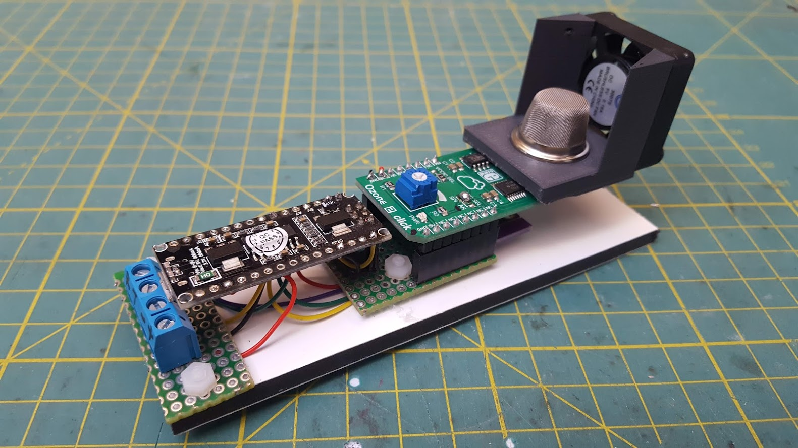
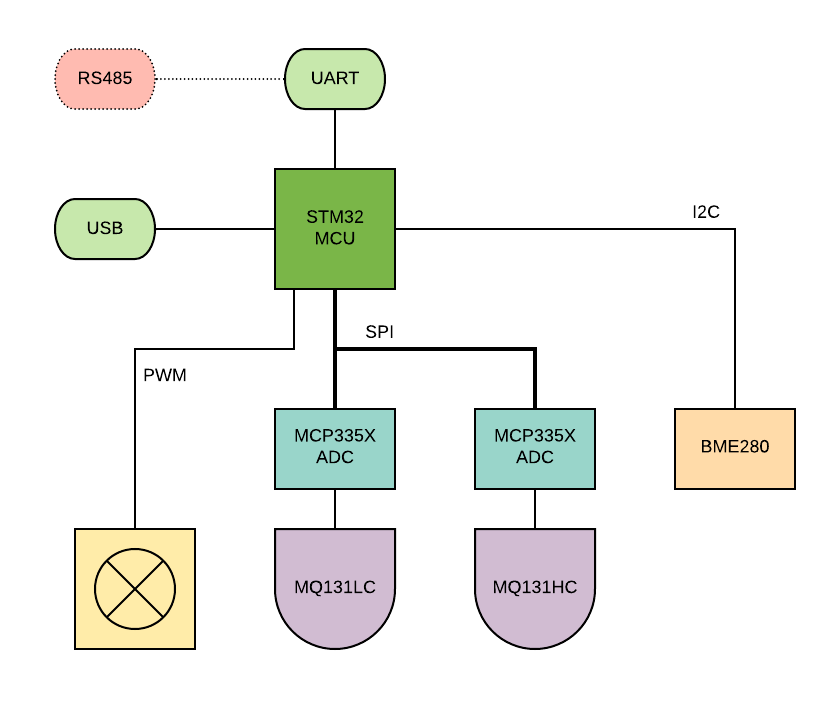
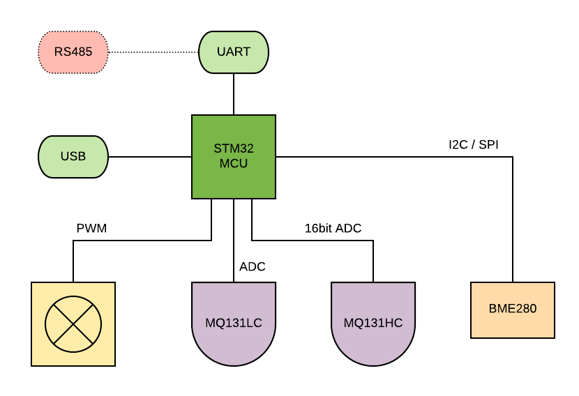

# open_ozone_sensor
*Air quality sensor for monitoring ozone levels*

## Proof of concept



### Components

* Arduino Nano (v3) or Uno (ATMega328)
* AM2320 - I2C Humidity and Temperature sensor ( temporary )
* Ozone2Click - SPI Ozone sensor ( based on MCP3551 and MQ131 )

### Sensor wiring

MCP3551 22bit adc on SPI and AM2320 on I2C.


| **Arduino pin** |  **Sensor pin**   |
| --------------- | ----------------- |
| 10              | MCP3551 - **CS**  |
| 12              | MCP3551 - **SDO** |
| 13              | MCP3551 - **SCK** |
| A4              | AM2320 - **SDA**  |
| A5              | AM2320 - **SCL**  |

### UART Protocol

```c++
// HEADER
typedef struct {
	uint8_t  firstLeadIn; // 0x55
	uint8_t  lastLeadIn;  // 0xAA
	uint8_t  packetLength;
	uint8_t  packetID;	  // 0 - error, 1 - sensor data, 2 - controller log
	uint8_t  headerCRC;	  // CRC8
} __PACKED UARTHEADER;

// SENSOR PACKET
typedef struct {
	float ozonePPM;
	float temperature;
	float humidity;
	float ratio;
} __PACKED SENSORPACK; 	  // + 2 bytes of CRC16
```


## Prototype

Prototype sensor board should incorporate both low and high concentration versions of MQ131 ozone sensors and a precise temperature and humidity sensor. For communication there should be an easy to access BUS to allow multiple sensor nodes to connect to a network and a central controller. *( At this point MODBUS and CAN are both an option. )*

### With external 22 bit ADC



### With internal 16 bit ADC

