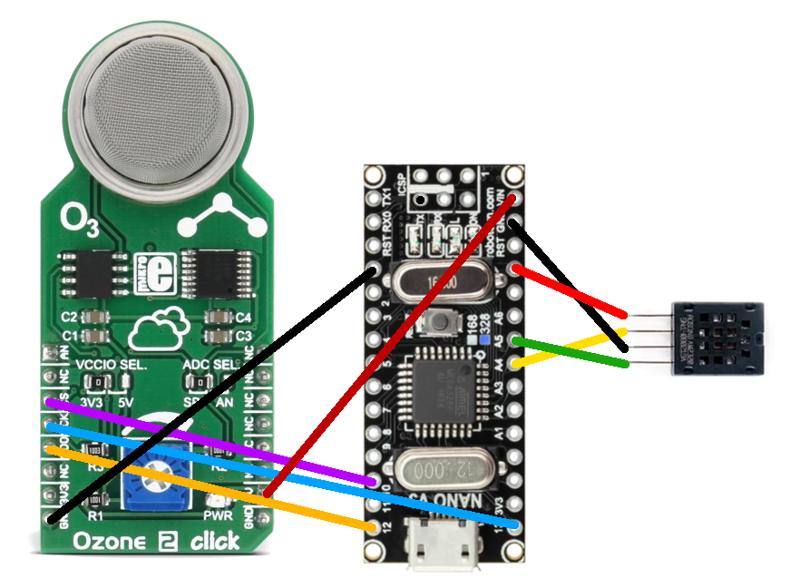

# open_ozone_monitor
*Air quality sensor for monitoring ozone levels*

### Components

* Arduino Nano (v3) or Uno (ATMega328)
* AM2320 - I2C Humidity and Temperature sensor ( temporary )
* Ozone2Click - SPI Ozone sensor ( based on MCP3551 and MQ131 )

### Sensor wiring

| **Arduino pin** |  **Sensor pin**   |
| --------------- | ----------------- |
| 10              | MCP3551 - **CS**  |
| 12              | MCP3551 - **SDO** |
| 13              | MCP3551 - **SCK** |
| A4              | AM2320 - **SDA**  |
| A5              | AM2320 - **SCL**  |
