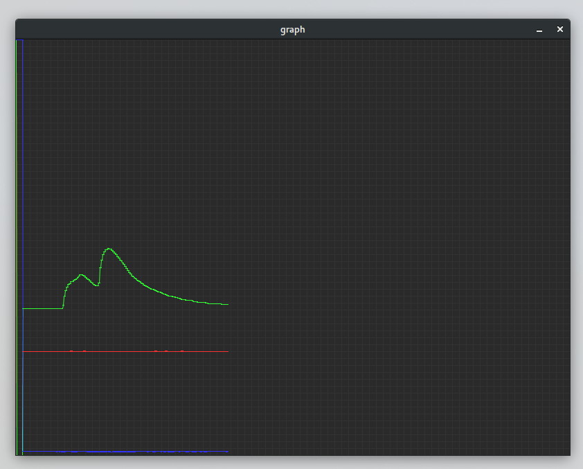

# open_ozone_monitor
*USB Air quality sensor for monitoring ozone levels*

### Components

* Arduino Nano (v3)
* AM2320 - I2C Humidity and Temperature sensor
* Ozone2Click - SPI Ozone sensor ( based on MCP3551 and MQ131 )

### Sensor wiring


### Serial output format

* 115200 / 8N1

```
O3: 2079791␍␊
TC: 26.90␍␊
RH: 35.10␍␊
```

### Graphing sketch

